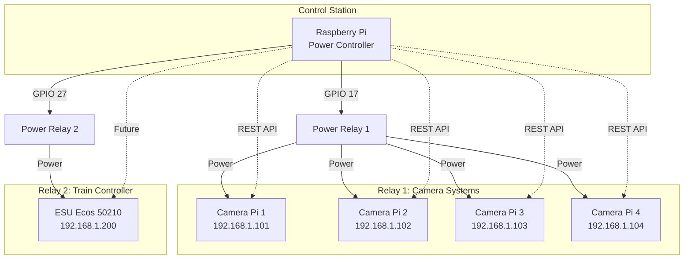
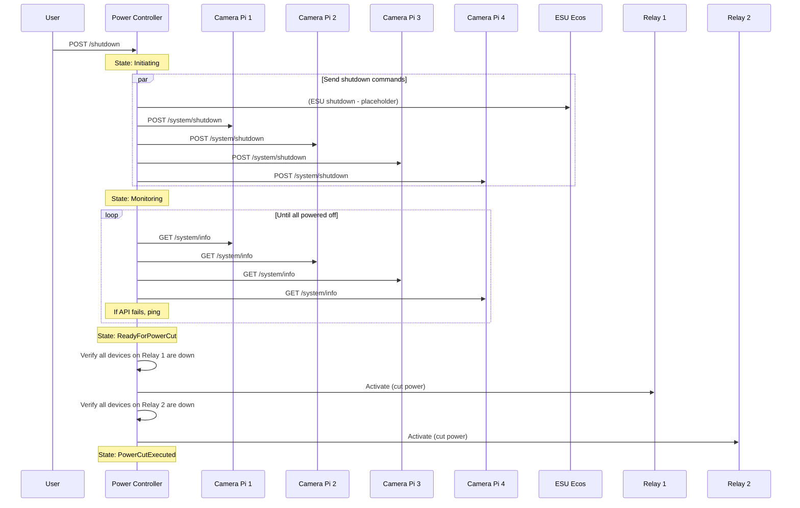

# Model Railway Power Controller Setup

This guide demonstrates how to set up Linksoft.PowerController for a model railway environment with multiple camera systems and train controllers.

## Scenario Overview



## Hardware Setup

### Components

| Device | Description | IP Address | Relay |
|--------|-------------|------------|-------|
| Power Controller | Raspberry Pi running this software | 192.168.1.100 | - |
| Camera Pi 1 | DietPi + Camera software | 192.168.1.101 | 1 |
| Camera Pi 2 | DietPi + Camera software | 192.168.1.102 | 1 |
| Camera Pi 3 | DietPi + Camera software | 192.168.1.103 | 1 |
| Camera Pi 4 | DietPi + Camera software | 192.168.1.104 | 1 |
| ESU Ecos 50210 | Model train controller | 192.168.1.200 | 2 |

### GPIO Wiring

| GPIO Pin | Function | Description |
|----------|----------|-------------|
| GPIO 17 | Relay 1 | Camera systems power rail |
| GPIO 27 | Relay 2 | Train controller power |

## Configuration

### appsettings.json

```json
{
  "App": {
    "DevicesFilePath": "data/devices.json"
  },
  "Mqtt": {
    "Enabled": false
  },
  "Relay": {
    "Relays": [
      {
        "Id": 1,
        "GpioPin": 17,
        "ActiveLow": true,
        "Description": "Camera systems power rail"
      },
      {
        "Id": 2,
        "GpioPin": 27,
        "ActiveLow": true,
        "Description": "ESU Ecos train controller"
      }
    ]
  },
  "Shutdown": {
    "DeviceAckTimeoutSeconds": 30,
    "StatusPollIntervalSeconds": 5,
    "MaxShutdownWaitSeconds": 300,
    "PingFailureThreshold": 3,
    "RelayHoldDurationMs": 1000
  }
}
```

### devices.json

```json
{
  "devices": [
    {
      "id": "11111111-1111-1111-1111-111111111111",
      "name": "Camera Pi 1",
      "ipAddress": "192.168.1.101",
      "type": "HostAgent",
      "endpointType": "RestApi",
      "port": 5000,
      "shutdownOrder": 1,
      "relayId": 1,
      "enabled": true
    },
    {
      "id": "22222222-2222-2222-2222-222222222222",
      "name": "Camera Pi 2",
      "ipAddress": "192.168.1.102",
      "type": "HostAgent",
      "endpointType": "RestApi",
      "port": 5000,
      "shutdownOrder": 1,
      "relayId": 1,
      "enabled": true
    },
    {
      "id": "33333333-3333-3333-3333-333333333333",
      "name": "Camera Pi 3",
      "ipAddress": "192.168.1.103",
      "type": "HostAgent",
      "endpointType": "RestApi",
      "port": 5000,
      "shutdownOrder": 1,
      "relayId": 1,
      "enabled": true
    },
    {
      "id": "44444444-4444-4444-4444-444444444444",
      "name": "Camera Pi 4",
      "ipAddress": "192.168.1.104",
      "type": "HostAgent",
      "endpointType": "RestApi",
      "port": 5000,
      "shutdownOrder": 1,
      "relayId": 1,
      "enabled": true
    },
    {
      "id": "55555555-5555-5555-5555-555555555555",
      "name": "ESU Ecos 50210",
      "ipAddress": "192.168.1.200",
      "type": "EsuEcos50210",
      "shutdownOrder": 0,
      "relayId": 2,
      "enabled": true
    }
  ]
}
```

## Shutdown Flow



## Getting Started

### 1. Install HostAgent on Camera Pis

On each Camera Raspberry Pi running DietPi:

```bash
# Install .NET 10 runtime
curl -sSL https://dot.net/v1/dotnet-install.sh | bash /dev/stdin --channel 10.0 --runtime aspnetcore

# Download and extract HostAgent
mkdir -p /opt/linksoft/hostagent
cd /opt/linksoft/hostagent
# Copy published files here

# Create systemd service
sudo nano /etc/systemd/system/linksoft-hostagent.service
```

Service file content:

```ini
[Unit]
Description=Linksoft Power Controller Host Agent
After=network.target

[Service]
Type=notify
ExecStart=/opt/linksoft/hostagent/Linksoft.PowerController.HostAgent
WorkingDirectory=/opt/linksoft/hostagent
Restart=always
RestartSec=10
Environment=ASPNETCORE_URLS=http://*:5000

[Install]
WantedBy=multi-user.target
```

Enable and start:

```bash
sudo systemctl daemon-reload
sudo systemctl enable linksoft-hostagent
sudo systemctl start linksoft-hostagent
```

### 2. Install Power Controller

On the main Raspberry Pi:

```bash
# Install .NET 10 runtime
curl -sSL https://dot.net/v1/dotnet-install.sh | bash /dev/stdin --channel 10.0 --runtime aspnetcore

# Download and extract Controller
mkdir -p /opt/linksoft/controller
cd /opt/linksoft/controller
# Copy published files here

# Create data directory
mkdir -p data

# Create systemd service
sudo nano /etc/systemd/system/linksoft-controller.service
```

Service file content:

```ini
[Unit]
Description=Linksoft Power Controller
After=network.target

[Service]
Type=notify
ExecStart=/opt/linksoft/controller/Linksoft.PowerController.Controller.RaspberryPi
WorkingDirectory=/opt/linksoft/controller
Restart=always
RestartSec=10
Environment=ASPNETCORE_URLS=http://*:5000

[Install]
WantedBy=multi-user.target
```

Enable and start:

```bash
sudo systemctl daemon-reload
sudo systemctl enable linksoft-controller
sudo systemctl start linksoft-controller
```

### 3. Configure Devices

1. Open the web UI: `http://192.168.1.100:5000`
2. Click "Add Device" for each device
3. Configure IP address, type, and relay assignment
4. Verify all devices show as "Online" in the status table

### 4. Test Shutdown

1. Click "Shutdown All" in the web UI
2. Monitor the progress as each device shuts down
3. Verify relay activation only occurs when all devices are confirmed down

## Safety Notes

- **Power cut is only triggered when ALL devices on a relay are confirmed powered off**
- The controller pings each device multiple times before confirming power-off
- If any device is still responding, that relay will NOT be activated
- The controller itself remains running after power cut
- Use the "Cancel" button during Initiating or Monitoring phases to abort

## Troubleshooting

### Device shows as "Unknown"

- Verify network connectivity: `ping 192.168.1.101`
- Check HostAgent is running: `curl http://192.168.1.101:5000/api/v1/system/info`
- Review HostAgent logs: `journalctl -u linksoft-hostagent -f`

### Relay not activating

- Check GPIO wiring
- Verify relay configuration in appsettings.json
- Check controller logs: `journalctl -u linksoft-controller -f`
- Look for "SAFETY ABORT" messages indicating devices still responding

### Shutdown stuck in Monitoring

- Increase `MaxShutdownWaitSeconds` in appsettings.json
- Check if devices are properly shutting down
- Increase `PingFailureThreshold` if network is unstable
